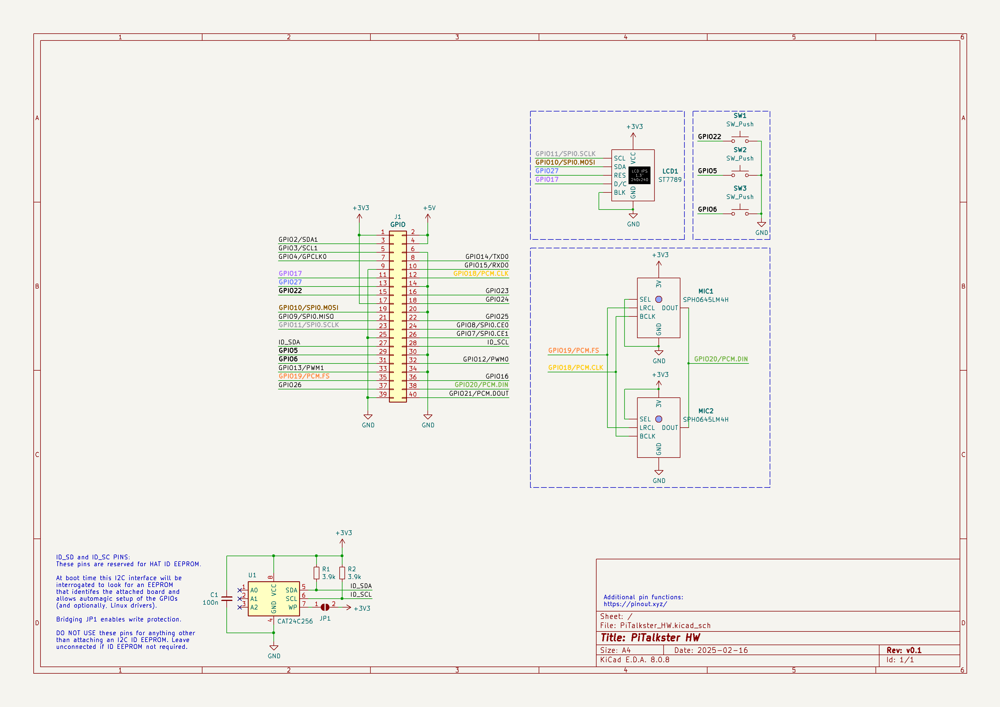
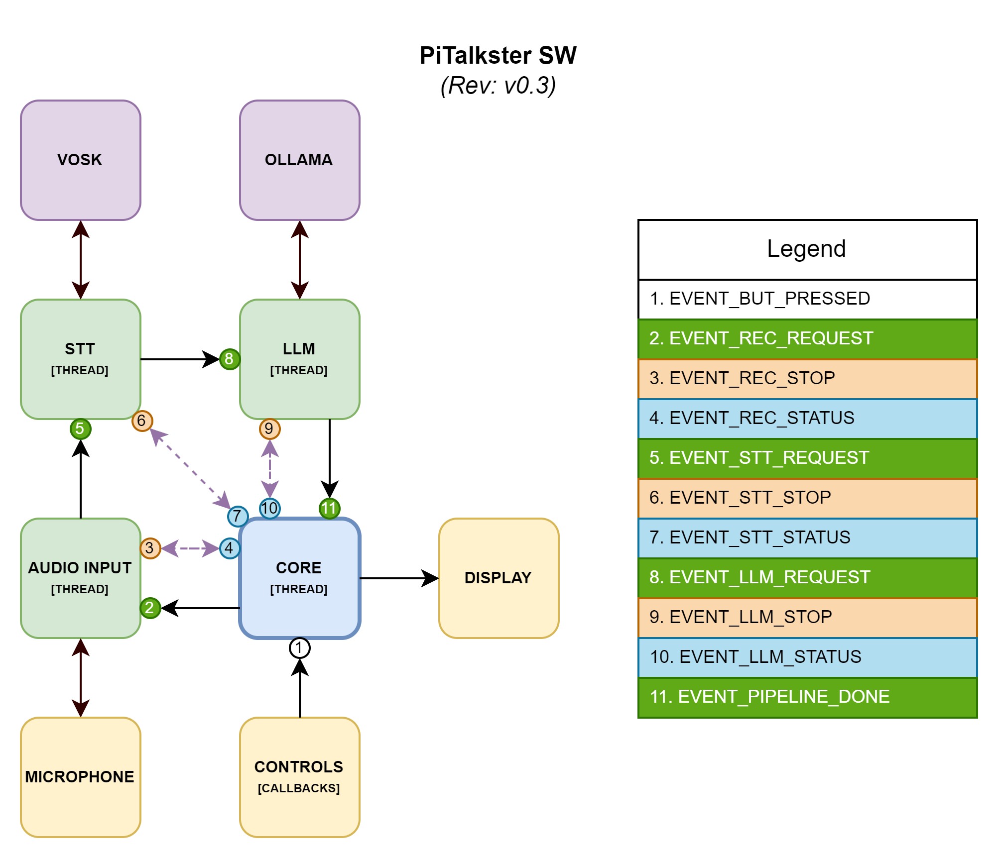

# 👾 PiTalkster

### 🍿 Disclaimer

> _Before I started this project, I decided to write a short disclaimer to present 
> some context of its creation. I wanted to create my own mini-product, 
> starting with the definition of "customer" requirements (that is, de facto mine) 
> until the implementation of a prototype that meets these requirements. 
> Since now there is hype on LLM (especially curious about models that can even 
> be run on Raspberry Pi), I came up with the idea of making a mini communicator/chat 
> on the RPi, with the ability to enter voice prompts, and receiving the result 
> on mini-display or using audio. I would like to go through the architecture 
> design stage, and write the main app mostly in C (due to the potential interaction 
> with HW, e.g. LCD and microphone) ~~preferably also using TDD~~. 
> Time will tell if this works out!_


---

### 🦐 Customer requirements

The system: 
- must be very simple to use,
- should allow user to speak prompts using the microphone,
- must run local AI model to process provided prompt 
(without requiring an internet connection),
- should display results on the LCD screen,
- must provide basic user controls,
- should include a menu for additional functions such as configuration and 
history viewing,
- could be designed for desktop use (does not need to be portable).

> _Customer does not impose a specific AI model, menu view, 
> configuration/history options etc._

### 💾 Technical requirements

- Platform: Raspberry Pi 4B+
- OS: Raspberry Pi OS Lite 64-bit. Debian version: 12 (bookworm)
- Power: 5V/3A, low power consumption is not a priority
- Display: LCD IPS 1.3" 240×240 with ST7789 controller
- Audio input: 2x SPH0645LM4H-B microphone MEMS I2S (stereo/mono mode)
- Controls: min. 3x physical buttons (2 for navigation, 1 for applying)
- LLM model: deepseek-r1:1.5b
- Enclosure: optional for demo

### ☑️ Acceptance criteria

- 🟢 The system on power-up must automatically display the main menu on the LCD screen.
- 🟢 The built-in microphone must accurately capture and record voice prompts with 
sufficient clarity for proper evaluation.
- 🟢 The LCD must clearly display interface elements, including menu and AI responses.
- 🟢 All physical buttons must be responsive (< 50 ms) and trigger their designated 
functions reliably.
- 🟢 The system must process prompts using local model entirely offline.
- 🟢 The menu must allow user to navigate, configure settings and view history 
without the need for login via SSH/UART or accessing the SD card.

---

### 🪅 Implementation

#### HW Diagram



#### SW Diagram



### 📟 Getting Started

#### 🍵 Quick Start

1. **Connect components** as per the HW diagram.
2. **Clone the repository**.
3. **Run the installation script**:

```bash
sudo ./tools/initial_setup.sh
```

*Note that an active internet connection is required for this step.* 
*Once the script completes, you will be prompted to reboot the system.*

4. After reboot, the app will **start automatically** and display status messages.

#### 🫵 Usage

Follow the instructions on the display. In short: 
- Press `O` (*SW2*) to **start/stop recording** (or to *interrupt another processing*)
- Press `<` (*SW3*) and `>` (*SW1*) to **scroll prompt and answer**

**DEMO**:

https://github.com/user-attachments/assets/431a1515-4794-44e1-9f1a-9ec3e95144d6

#### 🪇 Development

To cross-compile the application on a PC follow these steps:

1. **Run the script**:

```bash
./tools/cross-compilation/cross_container.sh brun
```

- `brun` - build and start the Docker container
- `build` - only build the container
- `run` - only start the container (if already built)

*The project folder is automatically mounted inside the container.*

2. **Compile the application**:

```bash
TARGET="rpi" make -j
```

---

### 📆 Future works

- 🪄 Expanding functionality 
  - Menu: implement configuration and displaying previous processed prompts 
    with responses
  - LLM|STT: try other models
- 🛠️ Improvements
  - Add the ability to compile for PC with simulation of some components
  - Implement custom library for display
  - Add more tests and extensive logging
